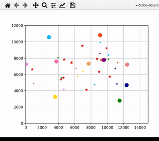

# Orders

Given a number of couriers with N stops, display
what position they'll be in as they make their
way to their destinations.

Currently all points are hard-coded it, but migrating
to a csv or json load would be trivial.

## Demo



## Install

Create and activate python virtual environment,
then install the required dependencies

```bash
$ python -m venv ./venv
$ source ./venv/bin/activate
$ pip -r ./requirements.txt
```

## Run

```bash
$ python ./orders.py
```

## TODO Notes

### Get the assignment right

So I started putting this together for demo before
I realized the assignment wasn't exactly what I thought.
Pausing development on this until a use case appears.

### Don't use Matplotlib

Matplotlib is great until you need to bring in PyQT5,
Might refactor to use bokeh as that leans on web.
The frustrating thing with bokeh is the callbacks are in javascript

### Load from a file

Need to sort out the proper assignment first, but then support
loading in via a provided file instead of requiring someone
to type up py code for everything

### Handle overshot

Right now I snap to an existing stop by zero'ing out all future
movement in a step. Instead, we should finish moving towards 
the next waypoint with the remainder of that step.
